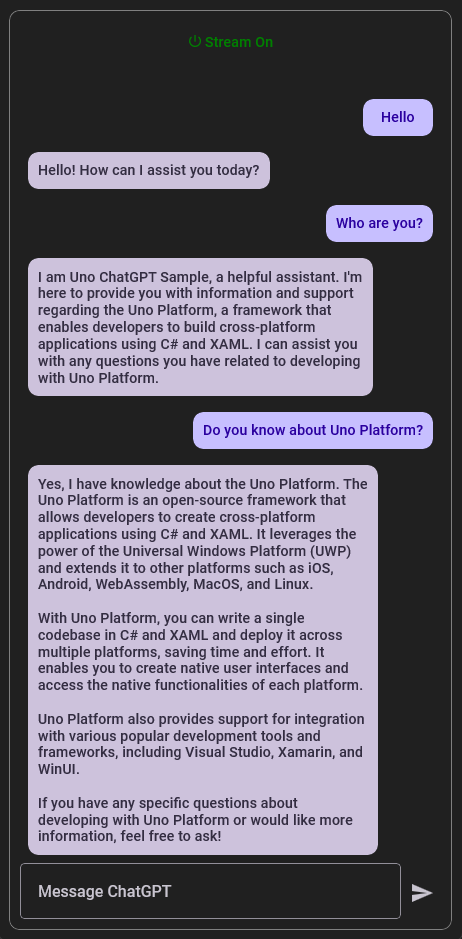

# ChatGPT

This is a ChatGPT Sample app using the OpenAI SDK. The app was built using [C# Markup](https://aka.platform.uno/csharp-markup) for the UI and [MVUX](https://aka.platform.uno/mvux) for state management, encouraging the flow of immutable data. [Records](https://learn.microsoft.com/en-us/dotnet/csharp/language-reference/builtin-types/record) are used to manage state and ensure immutability.



## Getting Started

1. **OpenAI API Key**: Obtain your OpenAI API key by visiting [https://platform.openai.com/api-keys](https://platform.openai.com/api-keys).

2. **Update Configuration**: After obtaining your API key, update the `appsettings.json` configuration file in the project with your OpenAI API key. Locate the `ApiKey` field and replace the placeholder with your actual API key.

```json
{
  "AppConfig": {
    "Environment": "Production",
    "ApiKey": "YOUR_API_KEY_HERE"
  }
}
```

## Codebase

 * [**MainPage.cs**](src/ChatGPT/Presentation/MainPage.cs): Defines the main user interface using C# Markup.
 * [**MainModel.cs**](src/ChatGPT/Presentation/MainModel.cs): Handle user input and methods to interact with the AI.
 * [**ChatService.cs**](src/ChatGPT/Services/ChatService.cs): Manages communication with the OpenAI API using the OpenAI SDK. This file contains the code responsible for making requests to the OpenAI API and handling the responses.
 * [**Message.cs**](src/ChatGPT/Presentation/Message.cs): Record that represents a message sent by the user or the AI.
 * [**ChatRequest.cs**](src/ChatGPT/Business/ChatRequest.cs): Record representing a request sent to the ChatGPT model.
 * [**ChatResponse.cs**](src/ChatGPT/Business/ChatResponse.cs): Record representing a response received from the ChatGPT model.

## Architecture Diagram

See below a Sequence Diagram showing how data is processed:

```mermaid
sequenceDiagram
    actor User as User
    participant MainPage as MainPage
    participant BindableMainModel as BindableMainModel
    participant MainModel as MainModel
    participant ChatService as ChatService

    User->>MainPage: 1. Input
    MainPage->>BindableMainModel: 2. AskMessageCommand
    BindableMainModel->>MainModel: 3. AskMessage(string)
    MainModel->>MainModel: 4. ListState.AddUserMessage(Message) : record
    MainModel->>MainModel: 5. CreateLoadingMessage(Message) : record
    MainModel->>MainModel: 6. CreateChatRequest() : ChatRequest : record
    MainModel->>ChatService: 7. AskAsStream(ChatRequest)
    ChatService->>ChatService: 8. CreateChatResponse() : record
    ChatService->>ChatService: 9. UpdateChatResponse() : record
    ChatService-->>MainModel: ChatResponse : record
    MainModel->>MainModel: 10. UpdateLoadingMessage(ChatResponse) : Message : record
    MainModel->>MainModel: 11. ListState.UpdateAsync(Message)
    MainModel-->>BindableMainModel: 12. INotifyCollectionChanged
    BindableMainModel-->>MainPage: UpdateUI
    MainPage-->>User: Message
```

Steps description:

1. The user types a message in the TextBox.
2. The `AskMessageCommand` is invoked in the auto-generated `BindableMainModel`.
3. The `BindableMainModel` calls the `AskMessage(string)` method in the MainModel.
4. A new `Message` record is created with the user's prompt and then added to the `ListState` (ImmutableList).
5. A new loading `Message` record is created and added to the `ListState`.
6. A `ChatRequest` record is created with the user's message.
7. The MainModel calls the `AskAsStream()` method with the `ChatRequest`.
8. An empty `ChatResponse` record is created.
9. As the AI returns a response, the `ChatResponse` record is updated until the AI finishes.
10. The loading `Message` record (created in step 5) is updated with the AI response.
11. `ListState.UpdateAsync` finds the message with the same `Id` and updates the instance, ensuring thread safety throughout the process.
12. `INotifyCollectionChanged` is raised to update the UI with the new message.

## Learn More
- [C# Markup](https://aka.platform.uno/csharp-markup) 
- [MVUX](https://aka.platform.uno/mvux)
- [How to write Records with MVUX](https://platform.uno/docs/articles/external/uno.extensions/doc/Learn/Mvux/WorkingWithRecords.html)