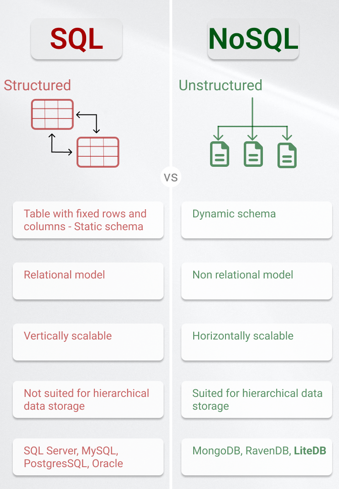
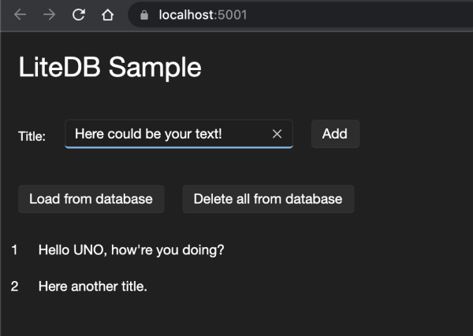

In this article we will have a closer look at **LiteDB**, a .NET NoSQL Document Store in a single data file. We will discover the advantages of **LiteDB** and why it is a viable candidate for your next project.

We will also explore what are the differences between a **NoSQL** and a *classical* **SQL** database are and what this has to do with the reminiscent **SQL CE** or the more modern **SQLite** database.

## LiteDB
**LiteDB** is a **document store**, which get's saved into a single file. That means that all your data resides in a single file. If you remember the *good old times*<sup>Citation needed</sup> you might remember [**SQL Server Compact**](https://en.wikipedia.org/wiki/SQL_Server_Compact), which is also a single file database based on the SQL Server. A modern version would be [**SQLite**](https://www.sqlite.org/onefile.html), which is also a single-file database. All of them are **server-less**, that means you don't need to install anything additional, which then runs in a background thread and does all the work. This simplicity enables a wide variety of scenarios (especially for rapid prototyping).

Some more points, which are listed on their [GitHub page](https://github.com/mbdavid/LiteDB):

* Serverless NoSQL Document Store
* Simple API, similar to MongoDB
* 100% C# code for .NET 4.5 / NETStandard 1.3/2.0 in a single DLL (less than 450kb)
* Thread-safe
* ACID with full transaction support
* Data recovery after write failure (WAL log file)
* Datafile encryption using DES (AES) cryptography
* Map your POCO classes to BsonDocument using attributes or fluent mapper API
* Store files and stream data (like GridFS in MongoDB)
* Single data file storage (like SQLite)
* Index document fields for fast search
* LINQ support for queries
* SQL-Like commands to access/transform data
* [LiteDB Studio](https://github.com/mbdavid/LiteDB.Studio) - Nice UI for data access
* **Open source** (❤️)and free for everyone - including commercial use

These are perfect preconditions to just try it out and use it right away, because we don't have to setup anything. Now you might ask yourself, **What would be typical use-cases for this?**.

* Mobile Apps (Xamarin ready)
* Desktop/local applications
* Application file format
* Smaller web applications
* One database per account/user data store

If you checked out the LiteDB website you often see **NoSQL** and that almost sounds like **SQL**, so before we deep diver with code, we should clarify what this two terms mean.

## To **SQL** or to **NoSQL** - that is the question
**NoSQL** stands for **n**ot **o**nly SQL. That means in contrast to **SQL**, which stands for **s**tructured **q**uery **l**anguage, **NoSQL** stores in a more dynamic way. *Not only* means that we can also use SQL language to ask for data, but there are also other ways. Traditionally SQL databases store data in a relational structure, mainly in tables with columns, which then can refer to other tables. In case of **LiteDB** we store the data in documents. Documents are roughly <abbr title="JavaScript Object Notation">**JSON**</abbr> objects. Each document contains pairs of key's and their corresponding values.

So if we have a C# object like this:
```csharp
public class BlogPost
{
    public string Title { get; set; }
    public string Content { get; set; }
    public bool IsPublished { get; set; }
    public List<string> Tags { get; set; }
}
```

Then a typical document representing that data in a document database could look like this:
```json
{
  "Title": "LiteDB - A .NET embedded NoSQL database",
  "Content": "This article contains a lot of information.",
  "IsPublished": true,
  "Tags": [
    ".NET",
    "NoSQL",
    "LiteDB"
  ]
}
```

Now the same in a traditional table and column-based SQL database wouldn't be that easy to model. Every 1 to n relationship has to be modified with a new table and foreign key relations. As the document database are "loose" in terms of structure we had no trouble modelling this, plus the structure mirrors our "real C#" entity.

Of course we simplify here a bit. On top we most probable have a unique identifier and some metadata about the object in question, but these are more details than we need right now. Hopefully you can see that it's super easy to get hierarchical data we have in our application. Everything is concise together in one object.



## LiteDB and UNO
Now we can use this power when we want to build a **UNO Platform** app. You might remember that we already could do something similiar with SQLite: *[Working with SQLite and WebAssembly for .NET Developers](https://platform.uno/blog/working-with-sqlite-and-webassembly-for-net-developers/)*. This article describes how to use SQLite with the UNO Platform. And guess what: We can do something similiar with **LiteDB** as well. So let's do it. If you did not setup the **UNO Platform** on your developer machine, head first to the [*Get Started* ](https://platform.uno/docs/articles/get-started.html)guide. Yes you read right, we can also use **LiteDB** inside the browser and therefore give the user an easy possibility to perist state! That is awesome! Here is what we are going for:



So let's create a new UNO Platform app. I am a big fan of the command line arguments, but you can also take the [Visual Studio Project templates](https://platform.uno/docs/articles/get-started-dotnet-new.html). To create a new app you can simply type: `dotnet new unoapp-uwp-net6 -o LiteDBSample` (the template allows also for optionally removing some UNO Platform heads: `dotnet new unoapp-uwp-net6 -o LiteDBSample -M=false -skia-wpf=false -skia-gtk=false -skia-linux-fb=false`. With this you are only running the WASM head). Don't worry you can also take other templates if you wish, as the code will work everywhere. Now if we want to use **LiteDB**, we have to reference the nuget package in your UNO Head<sup>[What is a Head?](https://platform.uno/docs/articles/uno-app-solution-structure.html)</sup> projects:

```csharp
dotnet add package LiteDB --version 5.0.15
```

Or alternatively just copy and paste this part into your csproj:
```xml
<ItemGroup>
  <PackageReference Include="LiteDB" Version="5.0.15" />
</ItemGroup>
```

With that out of the way, we are only working in the **Shared** project, and more specific in the **MainPage**-component, from now on. The full source code is at the end, so I will only show some key elements. The small app, as shown in the picutre, can hold some todo items for you. So we need a way to insert those items from the users point of view:

```xml
<TextBlock Grid.Row="0" Grid.Column="0" Text="Title:" Margin="0,10,0,0" />
<TextBox Grid.Row="0" Grid.Column="2" x:Name="todoText" />
<Button Grid.Row="0" Grid.Column="4" Click="AddTodoItem">Add</Button>
```

The important bit here is the `AddTodoItem` function. This will add the todo item to our **LiteDB**:
```csharp
private void AddTodoItem(object sender, RoutedEventArgs args)
{
    // Create the domain object from the text box
    var todoItem = new TodoItem
    {
        Text = todoText.Text
    };

    // Clear the model for the user
    todoText.Text = string.Empty;

    // Create a new LiteDb and insert the item
    var liteDatabase = new LiteDatabase(DbPath);
    var liteCollection = liteDatabase.GetCollection<TodoItem>();
    liteCollection.Insert(todoItem);
    liteCollection.Commit();
    _todoItems.Add(todoItem);
}
```

A bit more explanation: `var liteDatabase = new LiteDatabase(DbPath);` will either create and open a file with the given path (in this case `DbPath` which is just `Path.Combine(ApplicationData.Current.LocalFolder.Path, "save.db");`) or just read the file if it already exists. So we don't have to take care of much here. `liteDatabase.GetCollection<TodoItem>();` will give us the collection of objects, which are represented in our database. If you ever worked with **Entity Framework** the `LiteDatabase` object is your `DbContext` and `GetCollection<TodoItem>` represents your `DbSet<TodoItem>` on said `DbContext`. After that we insert the record and commit the transaction. `Commit` would translate to `SaveChanges` in Entity Framework. The last line adds the Todo-item in our in memory representation (an observable list) so the user directly sees a result.

Another small aspect I want to show in the application is this part:
```xml
<Button Click="LoadFromDatabase" Grid.Row="0" Grid.Column="0">Load from database</Button>
```

Here we load those entries from the database into the in memory collection.
```csharp
private void LoadFromDatabase(object sender, RoutedEventArgs args)
{
    var liteDatabase = new LiteDatabase(DbPath);
    var liteCollection = liteDatabase.GetCollection<TodoItem>();
    var todoItems = liteCollection
        .FindAll()
        .ToList();
    _todoItems.Clear();
    todoItems.ForEach(t => _todoItems.Add(t));
}
```

`FindAll` is basically a `ToList` on the whole collection. That is very basic. The neat thing is that we can use also **LINQ** with **LiteDB**.

```csharp
var todoItems = liteDatabase.GetCollection<TodoItems>().Query();
var itemsWhichShouldBeDoneByToday =
    (from item in todoItems
    where !item.IsDone && item.DeadLine <= DateTime.Now
    select item).ToList();
```
Of course you can also use the method chaining instead of the query language. The core idea is, that `Query()` returns you a `IQueryable`, which let's you use all the power of LINQ and friends. And there you have it, the easy and rapid power of **LiteDB** paired with the easiness and power of the **Uno Platform**.

## File System Initialization on WebAssembly

On WebAssembly, the file system is initialized asynchronously while the application is launching. Attempts to access the file system before this operation finalizes (e.g. during `Application.OnLaunched` or while the main page of the application is navigated to) may have unexpected results and could even cause a crash.

To prevent this, make sure to perform and await an asynchronous operation on `ApplicationData.Current.LocalFolder` first. A good example would be to store the database in a nested `Data` folder, which needs to be asynchronously created first:

```csharp
var localFolder = Windows.Storage.ApplicationData.Current.LocalFolder;
var dataFolder = await localFolder.CreateFolderAsync("Data", CreationCollisionOption.OpenIfExists);
var dbPath = System.IO.Path.Combine(dataFolder.Path, "save.db");
var liteDb = new LiteDatabase(dbPath);
```

## LiteDB `async`
One thing you might have noticed until now: All the methods I used are **synchrnous**. There is no `await liteDatabase.GetCollection<TodoItem>().ToListAsync()` or friends. You should consider the asynchrnous paradigm. If you have a regular desktop application or even the WASM head, `async` makes sense, as it doesn't block the UI thread. **LiteDB** itself doesn't offer asynchrnous operations, but there is a community project, which does that: [litedb-async](https://github.com/mlockett42/litedb-async).

## LiteDB Studio
As initially said there is also a [**LiteDB Studio**](https://github.com/mbdavid/LiteDB.Studio). With this UI tool you can submit queries to your "database". If you are coming from a SQL world, you can use all your well-known SQL queries and they are still working with **LiteDB**. There is unfortunately one big disadvantage at the moment: The studio does run only under Windows. The reason is simple: First it runs under the .NET Framework 4.7.2, which is only supported by Windows and second it is a WinForms application.

## Conclusion
I hope I could give you a nice introduction into **LiteDB** and why it is a viable candidate for your next project.

## Resources
 * [Getting started guide from LiteDB](https://www.litedb.org/docs/getting-started/)
 * [Homepage of LiteDB](https://www.litedb.org/)
 * [LiteDB async](https://github.com/mlockett42/litedb-async)