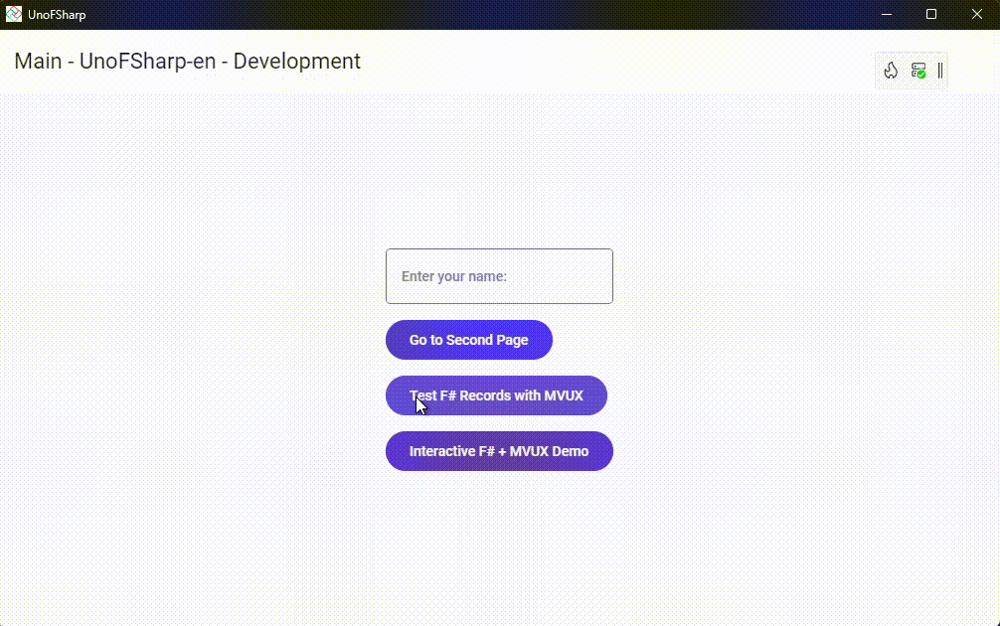

# Uno F# MVUX

This sample is the result of prompting Copilot to create an app that uses F# records with [MVUX](https://aka.platform.uno/mvux) in an [Uno Platform](https://platform.uno) application.

The app showcases F# integration with C# MVUX models, and can be run on all platforms, such as Desktop, WebAssembly, iOS, Android.

# Prompt

Copilot was prompted with the following: `Create a uno platform project where an F# record is defined and can be used with MVUX from Uno. Create a page that showcases this, with a F# record, reference it from a C# Uno app, bind to it via MVUX.`

Then, as a follow-up: `Create a more interactive page showcasing F# + MVUX.`

## Features

* **F# Records**: Demonstrates simple records and nested records defined in F#
* **MVUX Integration**: Shows how F# types work seamlessly with [MVUX](https://aka.platform.uno/mvux) state management
* **Type Safety**: Leverages F#'s type system while maintaining interoperability with C# code
* **Interactive Examples**: Includes State and Feed demonstrations with F# models

## What is the Uno Platform

[Uno Platform](https://platform.uno) is an open-source .NET platform for building single codebase native mobile, web, desktop, and embedded apps quickly.
For additional information about Uno Platform or if you have any feedback to share, please refer to the [README.md](../../README.md) file in this Samples repository.
